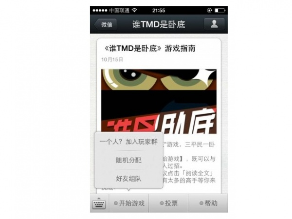

************
系统架构设计
************

简介
====

系统分为基础平台、应用组件和项目网站三个部分（形式都是django的app）。

基础平台提供如下的基本功能：

* 账号管理(目前仍然使用传统的注册登录机制，没有使用CAS)；
* 微信服务号和订阅号的接入；
* 接收来自微信服务号和订阅号的消息；
* 回复来自微信服务号和订阅号的消息（客服消息，必须在48小时
  内回复）；
* 群发微信消息；
* 微信支付接口(鉴于我们的是基于网页的，应该使用js版的微信
  支付接口，还没有仔细调查微信的支付接口，TBD)

应用组件（app）是建立在基础平台之上直接通过前端供终端商户或代理商使用的服务：

* 微消息（创建文本和图文消息）
* 微页面（创建基于模板的入口页面、列表页面或者内容页面）
* 微相册（创建基于模板的在微信中展示良好的相册，相册由微页面组成）
* 微网站（创建基于模板的在微信中展示良好的网站，网站由微页面组成）
* 微请柬（取代传统的请帖等实体邀请函的电子邀请函）
* 微预约（预约服务，可以扩展到订位、挂号的功能模块）
* 微活动（优惠劵、刮刮卡、大转盘、微投票和一站到底）
* 微调查（发起调研话题，可以对发送的数量和投票情况进行统计）
* 微游戏（通过组合应用微信接口开发有一定参与度的游戏，比如微信墙）
* 自定义微信菜单

项目网站包括功能介绍、经典案例、帮助文档和登录入口四个二级导航页面：

* 功能介绍：介绍
* 经典案例：
* 帮助文档：
* 登录入口：

服务器框架
==================

使用Django作为基础框架。

软件版本：

* Python 2.7
* Django 1.5

系统构架
============

前端
--------

Web前端框架
^^^^^^^^^^^^

* jQuery
* Bootstrap
* ACE

第三方插件
^^^^^^^^^^^

* jQuery.Validation

jQuery的表单校验插件。

http://docs.jquery.com/Plugins/Validation

所有的表单在提交前都应该进行校验。

* jQuery.Form

jQuery的ajax表单提交插件。

http://malsup.com/jquery/form/

凡是通过ajax方式提交的表单都应该使用这个插件进行。

* DataTable

集成Bootstrap V2和DataTable:

http://www.datatables.net/blog/Twitter_Bootstrap_2

DataTable可以用于友好的显示表格数据，并能自动对表格进行排序，过滤，分页。

模板与新增页面
^^^^^^^^^^^^^^

凡是涉及到管理的app的新页面都应该是一个小的子页面，并且扩展自 ``admin.task.base.inc.html``
参考 ``templates/account/``

ajax请求处理
^^^^^^^^^^^^^^

<a>标签定义了自定义的 ``data-url`` 属性，用于ajax加载请求。
比如页面左边的导航，在点击一个链接后，整个页面并不会刷新，只有右边的 #main-content 区域被刷新了。
它是怎么做到的呢？比如看下面一个导航的链接：

    <a href="#" data-url="dashboard"> 系统概况 </a>

系统会捕获点击事件，并加载 ``data-url`` 指向的链接，把页面内容加载到 #main-content 区域。
参考 ``admin.sidebar.inc.html``

表单处理
^^^^^^^^^^

为了能统一的处理表单和为表单提供统一的呈现方式，在 ``templates/form.inc.html`` 定义基本的表单样式，如果你有页面需要表单，应该 ``include`` 这个页面，并对参数进行相应的调整。

服务器端
--------

系统消息机制
^^^^^^^^^^^^^^^

.. index:: 系统消息机制

为了避免基础平台和app直接产生过度耦合，它们之间的消息采用 subscribe-publish 机制，
Django的 Signal_ 子模块实现了这个功能，目前暂定使用Signal以减少对第三方模块的依赖。

Signal_ 的好处是：简单，消息是同步发送的。因为有些消息（比如用户的消息或者菜单点击事件）是需要回复的，
所以同步消息机制对我们的系统就比较重要了。

Signal_ 的不足就是太实在是太简单了，它有如下一些不足：

- 不能支持订阅者的优先级，比如一个消息有两个订阅者，我想始终让其中一个订阅者先处理消息。
- 不能中断消息的处理，比如一个消息被某个订阅者处理了之后就不在传播给下个订阅者了。

.. _Signal: https://docs.djangoproject.com/en/dev/topics/signals/#defining-and-sending-signals

微信服务号和订阅号的接入
^^^^^^^^^^^^^^^^^^^^^^^^^^^^^^^^^

供商家注册并提供api链接让商家能在微信上去注册。

接收来自微信服务号和订阅号的消息
^^^^^^^^^^^^^^^^^^^^^^^^^^^^^^^^^^^^^^^^^^^^

消息有可能是用户发来的普通消息，也有可能是系统推送的事件消息。
在接收到消息后需要先验证消息的真实性以确保消息确实来自微信的服务器。

接收普通消息
^^^^^^^^^^^^^^^^^^^^^^^^^^^^^^^^^

当普通微信用户向公众账号发消息时，微信服务器将POST消息的XML数据包到开发者填写的URL上。
参考 http://mp.weixin.qq.com/wiki/index.php?title=接收普通消息

微信服务器在五秒内收不到响应会断掉连接，并且重新发起请求，总共重试三次

关于重试的消息排重，推荐使用msgid排重。

假如服务器无法保证在五秒内处理并回复，可以直接回复空串，微信服务器不会对此作任何处理，并且不会发起重试。

普通消息的类型有：

* 文本消息
* 图片消息
* 语音消息
* 视频消息
* 地理位置消息
* 链接消息

目前我们要支持文本消息的接收。文本消息示例：

.. code-block:: xml

    <xml>
    <ToUserName><![CDATA[toUser]]></ToUserName>
    <FromUserName><![CDATA[fromUser]]></FromUserName>
    <CreateTime>1348831860</CreateTime>
    <MsgType><![CDATA[text]]></MsgType>
    <Content><![CDATA[this is a test]]></Content>
    <MsgId>1234567890123456</MsgId>
    </xml>

接收事件推送
^^^^^^^^^^^^^^^^^^^^^^^^^^^^^^^^^

.. index:: 事件推送

事件推送的类型有：

1 关注/取消关注事件
2 扫描带参数二维码事件
3 上报地理位置事件
4 自定义菜单事件
5 点击菜单拉取消息时的事件推送
6 点击菜单跳转链接时的事件推送

关注/取消关注事件
^^^^^^^^^^^^^^^^^^^^^^

用户在关注与取消关注公众号时，微信会把这个事件推送到开发者填写的URL。方便开发者给用户下发欢迎消息或者做帐号的解绑。

微信服务器在五秒内收不到响应会断掉连接，并且重新发起请求，总共重试三次

关于重试的消息排重，推荐使用FromUserName + CreateTime 排重。

假如服务器无法保证在五秒内处理并回复，可以直接回复空串，微信服务器不会对此作任何处理，并且不会发起重试。

推送XML数据包示例：

.. code-block:: xml

    <xml>
    <ToUserName><![CDATA[toUser]]></ToUserName>
    <FromUserName><![CDATA[FromUser]]></FromUserName>
    <CreateTime>123456789</CreateTime>
    <MsgType><![CDATA[event]]></MsgType>
    <Event><![CDATA[subscribe]]></Event>
    </xml>

在收到关注/取消关注的时间我们需要做的处理：
一张表类记录有多少用户在关注我们，从什么时候开始关注。

.. code-block:: python

    class Follower(models.Model):
        """
        当前活跃的关注者。
        """
        username = models.CharField(max_length=128)
        follow_at = models.DateTime()

另外一张表来记录取消关注历史。

.. code-block:: python

    class FollowerHistory(models.Model):
        """
        取消关注的历史记录
        """
        username = models.CharField(max_length=128)
        unfollow_at = models.DateTime()

这个后期需要以报表的形式展现给客户看关注/取消关注的历史数据/走势。

回复来自微信服务号和订阅号的消息
^^^^^^^^^^^^^^^^^^^^^^^^^^^^^^^^^^^^^^^^^^^^

微信要求客服消息必须在48小时内回复。

群发微信消息
^^^^^^^^^^^^^^^^^^^^^^

基础平台只实现这个接口，供app来调用。

微信支付接口
^^^^^^^^^^^^^^^^^^^^^^

鉴于我们的是基于网页的，应该使用js版的微信支付接口，还没有仔细调查微信的支付接口，TBD
是否需要使用API来实现，让应用直接走我们的接口呢？

微相册
^^^^^^^^^^^^^^^^^^^^^^

创建基于HTML模板的内容丰富的消息并能批量下发给用户。
微网页包含的基本功能要求能基于模板创建消息，因此我们要有模板管理的功能，预先创建一组模板，如果能让用户定制模板就更好。

每创建一条消息赋予一个唯一的消息ID，供其它页面可以链接到这个页面。

参考目前微信推送的消息，目前推送的消息一般都是以列表的形式呈现的，我们前期也可以只考虑支持这种方法。

要群发微信消息，可以根据分组或者OpenID列表进行群发。在发送群发消息后，隔一段时间应该使用微信提供的接口去查询群发的结果，才能有多少发送成功/失败。

群发消息的步骤：

1. 上传图片资源到微信服务器，成功后得到一个唯一的thumb_media_id。
2. 上传图文消息素材，需要用到thumb_media_id，成功后得到一个唯一的media_id。

请求消息示例：

.. code-block:: python

    POST https://api.weixin.qq.com/cgi-bin/media/uploadnews?access_token=ACCESS_TOKEN

    {
       "articles": [
             {
                            "thumb_media_id":"qI6_Ze_6PtV7svjolgs-rN6stStuHIjs9_DidOHaj0Q-mwvBelOXCFZiq2OsIU-p",
                 "author":"xxx",
                 "title":"Happy Day",
                 "content_source_url":"www.qq.com",
                 "content":"content",
                 "digest":"digest"
             },
             {
                            "thumb_media_id":"qI6_Ze_6PtV7svjolgs-rN6stStuHIjs9_DidOHaj0Q-mwvBelOXCFZiq2OsIU-p",
                 "author":"xxx",
                 "title":"Happy Day",
                 "content_source_url":"www.qq.com",
                 "content":"content",
                 "digest":"digest"
             }
       ]
    }

3. 根据分组或者OpenID进行群发，成功后会得到一个唯一的msg_id。

请求消息示例：

.. code-block:: python

    POST https://api.weixin.qq.com/cgi-bin/message/mass/sendall?access_token=ACCESS_TOKEN
    {
       "filter":{
          "group_id":"2"
       },
       "mpnews":{
          "media_id":"123dsdajkasd231jhksad"
       },
        "msgtype":"mpnews"
    }

4. 实现“事件推送群发结果”获取群发结果。

由于群发任务提交后，群发任务可能在一定时间后才完成，因此，群发接口调用时，仅会给出群发任务是否提交成功的提示，若群发任务提交成功，则在群发任务结束时，会向开发者在公众平台填写的开发者URL（callback URL）推送事件。

推送的XML结构如下（发送成功时）:

.. code-block:: xml

    <xml>
    <ToUserName><![CDATA[gh_3e8adccde292]]></ToUserName>
    <FromUserName><![CDATA[oR5Gjjl_eiZoUpGozMo7dbBJ362A]]></FromUserName>
    <CreateTime>1394524295</CreateTime>
    <MsgType><![CDATA[event]]></MsgType>
    <Event><![CDATA[MASSSENDJOBFINISH]]></Event>
    <MsgID>1988</MsgID>
    <Status><![CDATA[sendsuccess]]></Status>
    <TotalCount>100</TotalCount>
    <FilterCount>80</FilterCount>
    <SentCount>75</SentCount>
    <ErrorCount>5</ErrorCount>
    </xml>

.. warning::

    这里的分组是什么进行分组的还不是很清楚。

我们的系统需要实现的功能：

* 支持用户上传多媒体文件到我们的服务器；
* 支持用户创建要群发的消息，只能是列表的形式，每个列表可以包含一个链接来指向一个我们已经创建的消息。
* 分组或者根据openid列表群发消息，需要实现这两个微信的API并根据业务逻辑来调用。

群发微信消息的接口参考：http://mp.weixin.qq.com/wiki/index.php?title=高级群发接口

消息自动回复
^^^^^^^^^^^^^^^^^^^^^^

目前我们已经能接收消息，需要一个匹配规则来自动回复消息。TBD

自定义微信菜单
^^^^^^^^^^^^^^^^^^^^^^

.. index:: 微信菜单

目前菜单只是指向特定的网页，获取预定义好的信息。
比如可以定义一个菜单是“最新活动”，点击后就打开预定义的最新活动信息页面。

一个示例的微信菜单：

目前自定义菜单最多包括3个一级菜单，每个一级菜单最多包含5个二级菜单。一级菜单最多4个汉字，二级菜单最多7个汉字，多出来的部分将会以“...”代替。请注意，创建自定义菜单后，由于微信客户端缓存，需要24小时微信客户端才会展现出来。建议测试时可以尝试取消关注公众账号后再次关注，则可以看到创建后的效果。

目前我们只支持view类型的事件，直接打开一个定义好的网页。
以后可以考虑支持click类型的事件来更智能的处理用户请求。
比如“注册”，“预约”类型的菜单命令就可以用click的类型来实现，服务器后台需要做进一步的处理。

创建微信菜单的请求示例：

.. code-block:: python

    POST https://api.weixin.qq.com/cgi-bin/menu/create?access_token=ACCESS_TOKEN

    {
     "button":[
     {
          "type":"click",
          "name":"预约",
          "key":"APPOINTMENT"
      },
      {
           "type":"view",
           "name":"最新消息",
           "key":"http://m.wewelink.cn/merchants/1/messages/latest"
      },
      {
           "name":"关于",
            {
               "type":"view",
               "name":"简介",
               "url":"http://m.wewelink.cn/merchants/1/intro"
            },
            {
               "type":"view",
               "name":"联系我们",
               "key":"http://m.wewelink.cn/merchants/1/contact"
            }]
       }]
    }

我们需要维护一张菜单的表，包含的字段有:

* owner （所属账号）
* parent （父菜单）
* 菜单类型（view, click）
* 菜单名称
* 菜单URL（view类型适应）
* 菜单KEY（click类型菜单使用）

我们的程序需要能根据数据库的表的内容自动构造创建菜单的请求json消息并能发送到微信服务器。
需要实现的功能模块：

* 创建菜单项
* 修改菜单项
* 删除菜单项
* 预览菜单层次（如果有时间需要做出预览的效果）
* 发送更新菜单请求。这个操作会把创建菜单的请求发送到微信服务器。

